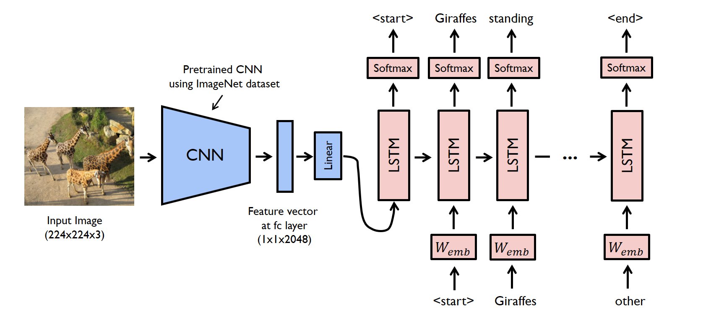

# Image Captioning Models

Deep learning models for automatic image caption generation using CNN-LSTM and CLIP-GPT2 architectures.

## 🚀 Models Implemented

- **CNN-LSTM**: Traditional approach using CNN for feature extraction and LSTM for sequence generation
- **CLIP-GPT2**: Modern approach combining CLIP vision encoder with GPT-2 language model

## 📊 Dataset

- **Flickr30k**: 31,783 images with 158,915 captions
- Each image has 5 different captions for training diversity
You can copy this as your README.md file:

# 🧠 Image Captioning Projects

This repository contains two different approaches for **image caption generation** using deep learning — a modern transformer-based model (CLIP-GPT2) and a traditional CNN-LSTM model.

---

## 📂 Project Structure


├── clip-gpt2.ipynb       # Image captioning using CLIP + GPT-2
├── CNN-LSTM.ipynb        # Image captioning using CNN + LSTM
├── README.md             # Project overview
├── sample_image/         # Folder containing test/output images


---

## 🚀 Models Overview

### 1. CLIP + GPT-2 Model
- Uses **OpenAI CLIP** to encode image features.
- Uses **GPT-2** to generate captions based on those features.
- Combines vision and language transformers for more natural, detailed captions.

**Features:**
- Transformer-based architecture.
- Beam search decoding.
- Repetition penalty for cleaner text.

**Model Architecture:**
Input Image
   ↓
CLIP Image Encoder
   ↓
Image Embedding
   ↓
Embedding Projector (to GPT-2 space)
   ↓
GPT-2 (conditioned on embedding + prompt)
   ↓
Generated Caption

---


### 2. CNN + LSTM Model
- Uses a **Convolutional Neural Network (CNN)** as the image encoder.
- Uses an **LSTM** as the language decoder.
- Classical approach to image captioning, trained on Flickr30k dataset.

**Features:**
- Custom PyTorch dataset and data loader.
- Learning rate scheduling and checkpoint saving.
- Early stopping for stable training.
- Beam search caption generation.

**Model Architecture:**
Input Image
   ↓
 CNN Encoder (ResNet)
   ↓
 Image Feature Vector
   ↓
 Feature Projection (FC)
   ↓
 LSTM Decoder -------> Word by word predictions
   ↓
 Final Caption



---

## 📊 Results

Both models generate captions for test images.

Example outputs:

📷 Image: 

🤖 Caption (CLIP-GPT2): "A man is standing on a ladder fixing a window"  
🤖 Caption (CNN-LSTM): "A man standing on on the window"


## 🧩 Datasets
Both notebooks use the **Flickr30k** dataset (or similar).  
Make sure your dataset has:
- Images (`.jpg` files)
- Captions in a CSV or text file with columns like `image, caption`

---

## ⚙️ Requirements

Install dependencies before running:
```bash
pip install torch torchvision transformers pillow scikit-learn matplotlib tqdm

🧪 Usage
Option 1: Run in Google Colab

Upload the notebooks to Colab.

Mount your drive and add the dataset.

Run all cells step-by-step.

Option 2: Run Locally
git clone https://github.com/<Dhanugupta0>/image-captioning.git
cd image-captioning
jupyter notebook

💡 Future Improvements

Add BLEU/METEOR evaluation metrics.

Fine-tune CLIP-GPT2 for custom datasets.

Add a web interface for testing captions interactively.

👨‍💻 Author

Dhanu Gupta
Engineering Student passionate about AI/ML and Computer Vision.